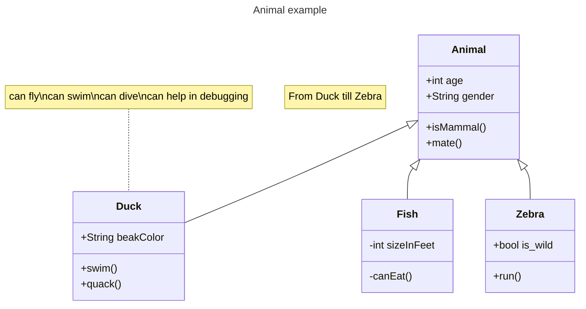

# UmlExamples
Test repository for investigating and trying out UML documentation in GitHub.

Links here to:
- [Sequence Diagrams](uml/sequence_diagrams/)
- [Class Diagrams](uml/class_diagrams/)

Or can add diagrams directly into the README file, as below.

