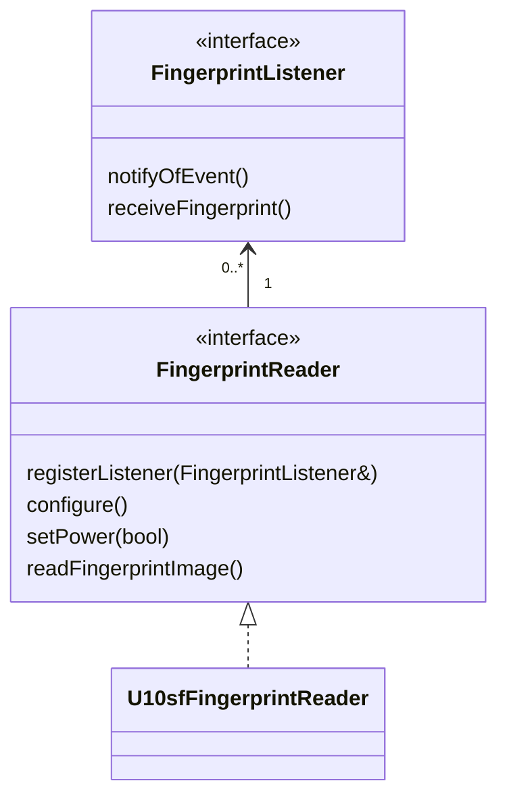

This file provides an interface definition for a Fingerprint Reader driver.

```mermaid
classDiagram

class FingerprintReader
<<interface>> FingerprintReader
FingerprintReader : registerListener(FingerprintListener&)
FingerprintReader : configure()
FingerprintReader : setPower(bool)
FingerprintReader : readFingerprintImage()

class FingerprintListener
<<interface>> FingerprintListener
FingerprintListener : notifyOfEvent()
FingerprintListener : receiveFingerprint()

FingerprintReader "1" --> "0..*" FingerprintListener

direction BT
class U10sfFingerprintReader 
U10sfFingerprintReader ..|> FingerprintReader
```