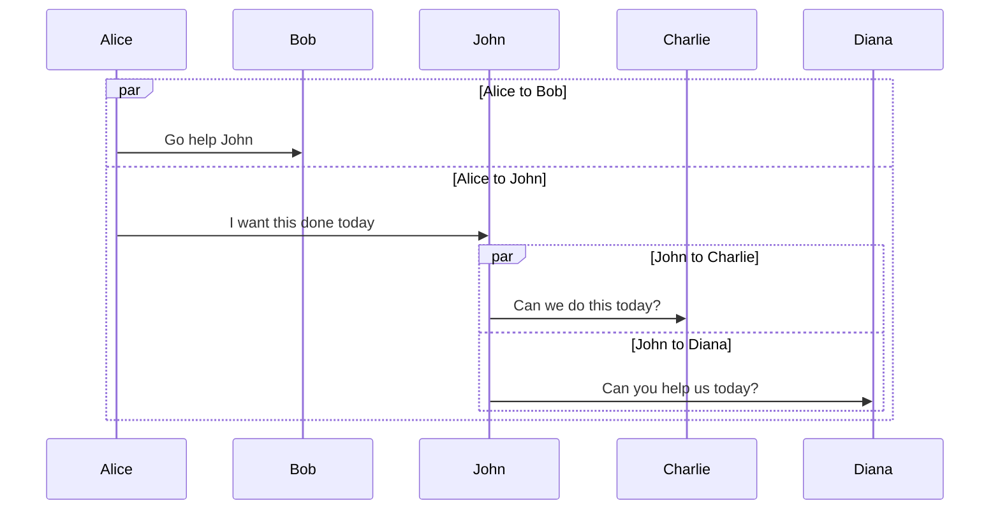

This markdown file is intended to demonstrate how to embed Mermaid-defined sequence diagrams in GitHub repos and Visual Code (with Markdown Preview Mermaid Support plugin).

```mermaid
sequenceDiagram
    par Alice to Bob
        Alice->>Bob: Go help John
    and Alice to John
        Alice->>John: I want this done today
        par John to Charlie
            John->>Charlie: Can we do this today?
        and John to Diana
            John->>Diana: Can you help us today?
        end
    end

```

